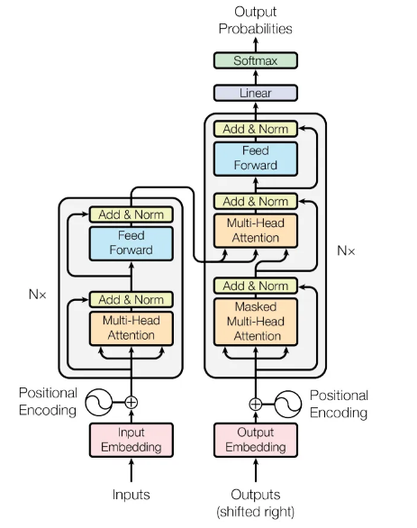
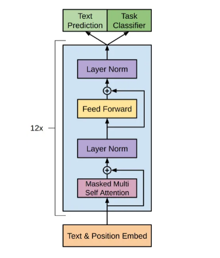

# GPT LLM Model

一个基于 Transformer 架构的 GPT 模型 Pytorch 实现，旨在提供一个本地复现可训练的文本生成模型。主要实现了文本生成的核心功能，支持多种配置的 GPT 模型。

## GPT 目录结构

```
gpt_model/
├── datasets/                                     # 存放训练数据集
│   └── the-verdict.txt                           # 用于训练的小型文本文件
├── img/                                          # 存放模型结构图
│   ├── gpt2_arch.png                             # GPT2模型结构图
│   └── transformer_arch.png                      # Transformer模型结构图
├── instruction_datas/                            # 指令微调的数据集
│   ├── instruction-data-with-response-lora.json  # 指令微调后生成的模型结果
│   └── instruction-data.json                     # 指令微调的数据集
├── lora_model/                                   # LoRA微调相关
│   └── gpt-sft-lora.pth                          # LoRA微调后的gpt模型参数
├── params/                                       # 保存模型参数
│   └── gpt_params.json                           # 模型配置参数
├── src/                                          # GPT组件目录，包括GPT中内部模型细节
│   ├── __init__.py
│   ├── feedforward.py                            # 前馈网络模块
│   ├── generate_text.py                          # 文本生成模块
│   ├── gpt_model.py                              # GPT模型定义与预训练参数加载模块
│   ├── gpt_training.py                           # GPT模型训练相关模块
│   ├── layernorm.py                              # 层归一化模块
│   ├── multihead_attention.py                    # 多头注意力模块
│   └── transformer_block.py                      # Transformer模块
├── tests/                                        # 测试代码目录
│   ├── __init__.py
│   ├── gpt_finetune_evaluate.py                  # 对指令微调后的指令结果进行打分
│   ├── gpt_generate_text_test.py                 # 测试GPT模型生成文本的结果
│   └── gpt_instruction_finetune.py               # 对GPT模型进行LoRA微调
├── train_metrics/                                # 训练过程图表
│   ├── finetune_training_metrics.pdf             # GPT模型的LoRA微调训练图表
│   └── text_train_metrics.pdf                    # GPT模型生成文本的训练图表
├── chainlit_main.py                              # 使用chainlit导入微调后的模型进行界面化对话
└── README.md/                                    # 项目README说明文档
```

## GPT 模型运行流程

- **测试文本生成**：python -m tests.test_gpt_model
- **进行指令微调**：python -m tests.gpt_instruction_finetune
- **微调结果打分**：python -m tests.gpt_finetune_evaluate
- **界面对话测试**：chainlit run chainlit_main.py

## Transformer模型和GPT模型对比

**Transformer架构示意图**：



**GPT架构示意图**：



### 模型解释

#### 1. 原始 Transformer 模型
- **组成部分**：
  - **编码器（Encoder）**：由多个相同的层堆叠而成，每层包含两个主要部分：
    - **多头自注意力机制**：允许模型在输入序列的不同位置之间建立联系。
    - **前馈神经网络**：对每个位置的表示进行非线性变换。
  - **解码器（Decoder）**：也由多个相同的层堆叠而成，结构与编码器相似，但增加了一个额外的多头注意力层，用于关注编码器的输出。
- **位置编码**：由于 Transformer 不具备序列信息，使用位置编码（Positional Encoding）来为每个输入的单词添加位置信息。
- **层数**：原始 Transformer 模型通常有 6 层编码器和 6 层解码器（在原始论文中）。
- **论文链接**：[Transformer论文-Attention Is All You Need](https://arxiv.org/pdf/1706.03762)
- **Transformer的Pytorch实现**：[Transformers from scratch](https://github.com/pbloem/former)

#### 2. GPT-2 模型（12层小型模型结构）
- **组成部分**：
  - **解码器（Decoder）**：GPT-2 仅使用 Transformer 的解码器部分，堆叠多个解码器层（例如，GPT-2 有 12、24、36、48 层，具体取决于模型大小）。
  - **自注意力机制**：使用因果自注意力（Causal Self-Attention），确保模型在生成文本时只关注当前和之前的单词。
- **位置编码**：同样使用位置编码来处理输入序列的位置信息。
- **层数**：GPT-2 的层数和参数量通常比原始 Transformer 更大，例如，GPT-2 的最大版本有 15 亿个参数。
- **论文链接**：[GPT-2论文-Language Models are Unsupervised Multitask Learners](https://cdn.openai.com/better-language-models/language_models_are_unsupervised_multitask_learners.pdf)

### 模型总结
- **架构**：原始 Transformer 包含编码器和解码器，而 GPT-2 仅使用解码器。
- **训练目标**：原始 Transformer 主要用于序列到序列任务，而 GPT-2 主要用于自回归文本生成。
- **应用场景**：原始 Transformer 适用于多种任务，GPT-2 则专注于文本生成。
- **优缺点**：原始 Transformer 灵活性高，但计算资源需求大；GPT-2 在文本生成上表现优异，但在特定任务上可能不如专门模型。

## GPT 模型内部细节

### 1. 嵌入层 (Embedding Layer)

- **词嵌入 (Token Embedding)**：使用 `nn.Embedding` 类将输入的词汇 ID 转换为对应的嵌入向量。每个词汇都有一个对应的向量表示，模型通过这些向量来理解词汇的语义。
- **位置嵌入 (Positional Embedding)**：由于 Transformer 模型不具备序列信息，位置嵌入用于为每个词汇提供位置信息。位置嵌入通过正弦和余弦函数生成，确保模型能够理解词汇在句子中的顺序。
- `src/gpt_model.py`中的嵌入层相关代码：
    ```python
    # 初始化词嵌入层
    self.tok_emb = nn.Embedding(cfg["vocab_size"], cfg["emb_dim"])
    # 初始化位置嵌入层
    self.pos_emb = nn.Embedding(cfg["context_length"], cfg["emb_dim"])
    ......
    ......
    ......
    # 获取词嵌入
    # Shape: (batch_size, num_tokens, emb_dim)
    tok_embeds = self.tok_emb(in_idx)
    # 获取位置嵌入
    # Shape: (num_tokens, emb_dim)
    pos_embeds = self.pos_emb(torch.arange(
        in_idx.size(1), device=in_idx.device))
    # 将词嵌入和位置嵌入相加
    x = tok_embeds + pos_embeds  # Shape: (batch_size, num_tokens, emb_dim)
    ```

### 2. Transformer 块 (Transformer Block)

每个 Transformer 块由以下几个部分组成，完整 Block 块可查看`src/transformer_block.py`：

**多头注意力机制 (Multi-Head Attention)**：
  - 通过多个注意力头并行计算，模型能够关注输入序列中的不同部分，从而捕捉更丰富的上下文信息。
  - 每个头独立计算注意力权重，使用以下公式：

$$
\text{Attention}(Q, K, V) = \text{softmax}\left(\frac{QK^T}{\sqrt{d_k}}\right)V
$$
  
  - 其中Q是查询，K是键，V是值， $d_k$ 是键的维度。
  - 最后，将所有头的输出拼接在一起，经过线性变换得到最终的输出。
  - 详情可查看`src/multihead_attention.py`

**前馈网络 (FeedForward Network)**：
  - 该网络负责对每个位置的表示进行非线性变换，增强模型的表达能力。
  - 在每个 Transformer 块中，经过注意力机制的输出会传递到前馈网络。前馈网络通常由两个线性层和一个激活函数（如 GELU）组成，公式如下：

$$
\text{FFN}(x) = \text{GeLU}(xW_1 + b_1)W_2 + b_2
$$

  - 详情可查看`src/FeedForward.py`

**层归一化 (Layer Normalization)**：
  - 在每个子层（注意力和前馈网络）之后，应用层归一化以稳定训练过程，减少内部协变量偏移。层归一化的公式为：

$$
    \text{LayerNorm}(x) = \frac{x - \mu}{\sigma} \cdot \gamma + \beta
$$
  - 其中 $\mu$ 和 $\sigma$ 分别是均值和标准差， $\gamma$ 和 $\beta$ 是可学习的参数。
  - 详情可查看`src/layernorm.py`

**残差连接 (Residual Connection)**：
  - 在每个子层的输出与输入之间添加残差连接，帮助模型更好地学习和训练。公式为：

$$
    \text{Output} = \text{LayerNorm}(x + \text{Sublayer}(x))
$$
  - `src/transformer_block.py`中的残差连接相关代码：
    ```python
    # 残差连接1: 注意力机制
    shortcut = x
    x = self.norm1(x)          # 层归一化
    x = self.att(x)            # 多头注意力
    x = self.drop_shortcut(x)  # Dropout
    x = x + shortcut           # 残差连接

    # 残差连接2: 前馈网络
    shortcut = x
    x = self.norm2(x)          # 层归一化
    x = self.ff(x)             # 前馈网络
    x = self.drop_shortcut(x)  # Dropout
    x = x + shortcut           # 残差连接
    ```

### 3. 输出层 (Output Layer)

- 输出层是一个**线性层**，将 Transformer 块的输出映射到词汇表大小的概率分布，模型通过 softmax 函数生成每个词汇的预测概率：
  1. **计算 logits**：
    对于每个时间步 $t$，模型的输出可以表示为：
    $$
    z_t = W_{out} h_t + b_{out}
    $$
    - $z_t$ 是当前时间步的 logits 向量。
    - $W_{out}$ 是输出权重矩阵。
    - $h_t$ 是当前时间步的隐藏状态。
    - $b_{out}$ 是输出偏置项。
  2. **应用 softmax 函数**：
    将 logits 转换为概率分布：
    $$
    P(x_t | x_{1:t-1}) = \text{softmax}(z_t) = \frac{e^{z_t}}{\sum_{j} e^{z_t^j}}
    $$
    - $P(x_t | x_{1:t-1})$ 是在给定前面词的条件下，当前词 $x_t$ 的预测概率。
    - $z_t^j$ 是 logits 向量中第 $j$ 个元素，表示词汇表中第 $j$ 个词的 logits。

- `src/gpt_model.py`中输出层相关代码：
    ```python
    # 应用Dropout
    x = self.drop_emb(x)
    # 通过Transformer块
    x = self.trf_blocks(x)
    # 应用最终的层归一化
    x = self.final_norm(x)
    # 通过输出头, 得到对数概率分布
    # Shape: (batch_size, num_tokens, vocab_size)
    logits = self.out_head(x)
    ```

## GPT 模型训练策略

### 1. 学习率调度

**学习率预热 (Learning Rate Warmup)**：在训练的初期，逐渐增加学习率，以避免模型在初始阶段的震荡。通常在前几个 epoch 中逐步增加学习率，达到设定的最大值后再进行衰减。具体实现中，学习率在前 N 个步骤内线性增加，公式为：

$$
  \text{lr}(t) = \frac{t}{N} \cdot \text{lr}_{max}
$$

  - 其中 $t$ 是当前步骤， $N$ 是预热的步骤数， $\text{lr}_{max}$ 是最大学习率。
  - `src/gpt_training.py`中学习率预热相关代码：
    ```python
    peak_lr = optimizer.param_groups[0]["lr"]             # 获取最大学习率
    total_training_steps = len(train_loader) * n_epochs   # 计算总训练步数
    lr_increment = (peak_lr - initial_lr) / warmup_steps  # 计算学习率增量
    ```

**余弦衰减 (Cosine Decay)**：一种平滑降低学习率的策略，让学习率从初始值逐渐下降到最小值，以帮助模型在接近收敛时更精细地调整参数，变化曲线像余弦函数的一半周期（从0到π）。
**核心思想**：
  - 训练初期：用较大的学习率快速收敛。  
  - 训练后期：用较小的学习率精细调整参数，避免震荡。
  - 比线性衰减更平滑，能更好地逼近最优解。  
  - 具体公式：

$$
\eta_t = \eta_{\text{min}} + \frac{1}{2}(\eta_{\text{max}} - \eta_{\text{min}}) \left(1 + \cos\left(\frac{t}{T} \pi\right)\right)
$$

  - $T$ ：总训练步数（从最大学习率衰减到最小学习率的步数）。
  - $t$ ：当前训练步数（ 0 $\leq t$ $\leq T$ ）。
  - $\eta_{\text{min}}$ ：最小学习率（通常设为0或接近0）。
  - $\eta_{\text{max}}$ ：初始学习率（最大值）。
  - `src/gpt_training.py`中余弦衰减相关代码：
    ```python
    progress = ((global_step - warmup_steps) / (total_training_steps - warmup_steps))
    lr = min_lr + (peak_lr - min_lr) * 0.5 * (1 + math.cos(math.pi * progress))
    ```

**梯度裁剪 (Gradient Clipping)**：一种防止梯度爆炸（Gradient Explosion）的技术，在训练深度学习模型（如GPT）时，梯度可能会变得非常大，导致模型参数更新不稳定，甚至无法收敛。梯度裁剪的作用就是限制梯度的大小，使其不超过某个设定的阈值（threshold）

梯度裁剪的公式（L2范数裁剪）
  - 计算梯度的L2范数（长度）：

$$
   \text{grad\_norm} = \sqrt{\sum_{i} g_i^2}
$$

  - $g_i$ 是梯度的每个分量（每个参数的梯度）。
  - `src/gpt_training.py`中梯度裁剪相关代码：
    ```python
    if global_step >= warmup_steps:     # 预热阶段后应用梯度裁剪
        torch.nn.utils.clip_grad_norm_(model.parameters(), max_norm=1.0)
    ```

梯度裁剪（Gradient Clipping）公式的简单解释：计算所有梯度的平方和，再开平方，得到梯度的总长度。

**判断是否裁剪**：
  - 如果 grad_norm > threshold，说明梯度太大，需要裁剪。
  - 如果 grad_norm ≤ threshold，梯度正常，不需要裁剪。

**裁剪方法**：

如果梯度太大，就按比例缩小梯度，使其长度等于 threshold：

$$
\text{clipped\_grad} = \frac{\text{threshold}}{\text{grad\_norm}} \cdot \text{grad}
$$

这样，裁剪后的梯度长度就是 threshold，不会过大。

**梯度裁剪的作用**：
  - 防止梯度爆炸：特别是在RNN、LSTM、Transformer等模型中，梯度可能会变得非常大，导致训练失败。
  - 稳定训练：让梯度保持在一个合理的范围内，避免参数更新过大或过小。
  - 提高收敛性：避免模型因梯度爆炸而无法收敛。

### 2. 选取批量大小

- 选择合适的批量大小以平衡训练速度和内存使用。较大的批量大小可以加速训练，但可能会导致内存不足。通常在训练过程中会进行实验以找到最佳的批量大小。
- `tests/gpt_generate_text_test.py`中批量大小设置相关代码：
```python
# 训练集占 80%, 验证集占 20%
train_ratio = 0.80
split_idx = int(train_ratio * len(text_data))

# 创建训练数据加载器
train_loader = create_dataloader(
    text_data[:split_idx],                    # 使用前 80% 数据作为训练集
    batch_size=2,                             # 每个批次包含 2 个样本
    max_length=gpt_config["context_length"],  # 每个输入序列的最大长度
    stride=gpt_config["context_length"],      # 滑动窗口步长
    drop_last=True,                           # 如果最后一个批次不完整, 则丢弃
    shuffle=True,                             # 每个 epoch 开始时打乱数据
    num_workers=0                             # 不使用多线程加载数据
)

# 创建验证数据加载器
val_loader = create_dataloader(
    text_data[split_idx:],                    # 使用后 20% 数据作为验证集
    batch_size=2,                             # 每个批次包含 2 个样本
    max_length=gpt_config["context_length"],  # 每个输入序列的最大长度
    stride=gpt_config["context_length"],      # 滑动窗口步长
    drop_last=False,                          # 不丢弃最后一个不完整的批次
    shuffle=False,                            # 验证集不需要打乱数据
    num_workers=0                             # 不使用多线程加载数据
)
```
- `tests/gpt_instruction_finetune.py`中批量大小设置相关代码：
```python
# 定义数据加载的参数
num_workers, batch_size, allowed_max_length = 0, 8, 1024

# 自定义数据加载函数
customized_collate_fn = partial(
    custom_collate_fn, device=device, allowed_max_length=allowed_max_length)

# 创建训练集和验证集的数据集对象
train_dataset = InstructionDatasetPhi(train_data, tokenizer)
train_loader = DataLoader(
    train_dataset,
    batch_size=batch_size,
    collate_fn=customized_collate_fn,
    shuffle=True,            # 随机打乱训练数据
    drop_last=True,          # 如果最后一个batch不满，丢弃它
    num_workers=num_workers  # 数据加载的工作线程数
)

val_dataset = InstructionDatasetPhi(val_data, tokenizer)
val_loader = DataLoader(
    val_dataset,
    batch_size=batch_size,
    collate_fn=customized_collate_fn,
    shuffle=False,  # 验证数据不需要打乱
    drop_last=False,
    num_workers=num_workers
)
```

### 3. 正则化 (Regularization)技术

#### 1. Dropout
- **定义**：Dropout 是一种防止神经网络过拟合的技术。在训练过程中，随机地将一部分神经元的输出设为零（即“丢弃”），以减少神经元之间的相互依赖。
- **作用**：通过减少神经元的共适应性，Dropout 可以提高模型的泛化能力。
- **使用**：通常在全连接层或卷积层后使用，训练时启用，推理时禁用。
- 在前馈网络和注意力层中使用 Dropout 技术，以减少过拟合。通过随机丢弃一定比例的神经元，增强模型的泛化能力。通常设置为 0.1 到 0.3 之间。
- 详情可查看`src/gpt_model.py`、`src/multihead_attention.py`、`src/transformer_block.py`

#### 2. L1 正则化（本次未使用）
- **定义**：L1 正则化通过在损失函数中添加权重绝对值的和来惩罚模型的复杂性。其公式为：
  $$
  L = L_{original} + \lambda \sum |w_i|
  $$
  其中 $L_{original}$ 是原始损失，$w_i$ 是模型的权重，$\lambda$ 是正则化强度。
- **作用**：L1 正则化可以导致稀疏解，即一些权重被压缩到零，从而选择特征。
- **使用**：适用于特征选择和高维数据。

#### 3. L2 正则化
- **定义**：L2 正则化通过在损失函数中添加权重平方和来惩罚模型的复杂性。其公式为：
  $$
  L = L_{original} + \lambda \sum w_i^2
  $$
  其中 $L_{original}$ 是原始损失，$w_i$ 是模型的权重，$\lambda$ 是正则化强度。
- **作用**：L2 正则化可以防止权重过大，从而减少过拟合，但不会导致稀疏解。
- **使用**：常用于大多数深度学习模型回归和分类任务中。
- `tests/gpt_generate_text_test.py`中weight_decay相关代码：
```python
# 使用 AdamW 优化器, 设置初始学习率和权重衰减
optimizer = torch.optim.AdamW(model.parameters(), lr=peak_lr, weight_decay=0.1)
```
- `tests/gpt_instruction_finetune.py`中weight_decay相关代码：
```python
# 最大学习率
peak_lr = 6e-5
......
......
......
# 定义优化器
optimizer = torch.optim.AdamW(model.parameters(), lr=peak_lr, weight_decay=0.1)
```

#### 4. 三种正则化技术对比
| 特性         | Dropout                          | L1 正则化                     | L2 正则化                     |
|--------------|----------------------------------|-------------------------------|-------------------------------|
| **原理**     | 随机丢弃神经元                   | 权重绝对值之和                | 权重平方和                    |
| **效果**     | 减少神经元间的相互依赖           | 促使部分权重为 0（特征选择） | 减小所有权重的大小            |
| **实现方式** | 在训练时随机失活神经元           | 在损失函数中添加 L1 项       | 在损失函数中添加 L2 项       |
| **适用场景** | 深度学习模型                     | 特征选择和稀疏模型           | 一般的回归和分类任务          |

### 4. 训练过程监控

- 在训练过程中，定期评估模型在验证集上的性能，监控训练损失和验证损失，并生成训练图表。
- 详情可查看`train_metrics/finetune_training_metrics.pdf`和`text_train_metrics.pdf`

### 5. 文本生成相关

在生成文本时，使用多种策略来控制生成的内容和多样性。以下是三种常用的生成策略：

- **温度采样**：
  - 温度采样通过调整温度参数 $T$ 来控制生成文本的多样性。温度越高（$T > 1$），生成的文本越随机，选择的词汇分布更加平滑，可能会引入更多的多样性；温度越低（$T < 1$），生成的文本则更集中，选择的词汇更倾向于概率较高的词汇，生成的内容更具确定性。
  - 温度采样的公式如下：
    $$
    P(x) = \frac{e^{\frac{\log(P(x))}{T}}}{\sum_{i} e^{\frac{\log(P(x_i))}{T}}}
    $$
  - **公式解释**：
    - **$P(x)$**：表示生成下一个词汇 $x$ 的概率。
    - **$P(x_i)$**：表示模型预测的词汇 $x_i$ 的原始概率。
    - **$T$**：温度参数。它控制生成文本的多样性。
      - 当 $T > 1$ 时，生成的文本更加随机，选择的词汇分布更加平滑，可能会引入更多的多样性。
      - 当 $T < 1$ 时，生成的文本则更集中，选择的词汇更倾向于概率较高的词汇，生成的内容更具确定性。
    - **$e$**：自然对数的底数，约等于 2.71828。
    - **$\log(P(x))$**：表示词汇 $x$ 的对数概率。对数变换可以将乘法运算转换为加法运算，便于计算。
  - **公式的工作原理**：
    1. **对数变换**：首先，对每个词汇的概率进行对数变换，这样可以避免在计算过程中出现数值下溢的问题。
    2. **温度调整**：通过将对数概率除以温度参数 $T$，可以调整概率分布的形状：
       - **高温度 ($T -> 1$)**：对数概率被缩小，导致概率分布更加平滑，增加了低概率词汇被选择的可能性，从而提高生成文本的多样性。
       - **低温度 ($T -> 0$)**：对数概率被放大，导致概率分布更加尖锐，增加了高概率词汇被选择的可能性，从而使生成的文本更具确定性。
    3. **归一化**：最后，通过对所有词汇的调整后概率进行归一化，确保所有词汇的概率和为 1。
  - `src/generate_text.py`中**温度采样**相关代码：
  ```python
  # 温度调节: 温度越高分布越平滑, 温度趋近0时接近贪婪采样
  if temperature > 0.0:
      # 通过温度参数缩放对数概率
      logits = logits / temperature
      # 将缩放后的logits转换为概率分布
      probs = torch.softmax(logits, dim=-1)
      # 根据概率分布进行随机采样
      idx_next = torch.multinomial(probs, num_samples=1)
  else:
      # 温度=0时直接取概率最大的token(确定性输出)
      idx_next = torch.argmax(logits, dim=-1, keepdim=True)
  ```

- **Top-k 采样**：
  - Top-k 采样在每一步生成中，仅考虑概率最高的 $k$ 个词汇进行采样。这种方法通过限制选择范围，避免低概率词汇的影响，从而提高生成文本的质量和相关性。
  - 例如，如果 $k=10$，则在每一步中只会从概率最高的 10 个词汇中进行选择，其他词汇将被忽略。
  - `src/generate_text.py`中**Top-k 采样**相关代码：
  ```python
  # top-k过滤: 仅保留概率最高的k个token
  if top_k is not None:
      # 获取前k大的对数概率值及其索引
      top_logits, _ = torch.topk(logits, top_k)
      # 确定第k大的值作为阈值
      min_val = top_logits[:, -1]
      # 将小于阈值的logits设为负无穷(对应概率为0)
      logits = torch.where(logits < min_val, torch.tensor(
          float("-inf")).to(logits.device), logits)
  ```

- **Top-p 采样（核采样）**（本次未使用）：
  - Top-p 采样在每一步中选择概率累积达到 $p$ 的最小词汇集合进行采样。与 Top-k 采样不同，Top-p 采样的选择范围是动态的，能够根据当前的概率分布自动调整。
  - 具体来说，选择满足以下条件的词汇集合 $S$：
    $$
    \sum_{x \in S} P(x) \geq p
    $$
  - 这种方法可以确保生成的文本既有多样性，又保持一定的质量，因为它会根据上下文动态选择合适的词汇。

## GPT 模型训练和微调相关

### 模型训练步骤
- 详情可查看`src/gpt_training.py`中的`train_model`函数
1. **初始化**: 函数开始时初始化已见 token 数和全局步数，并计算最大学习率和总训练步数。
2. **训练循环**: 在每个 epoch 中，模型进入训练模式，并对每个输入批次进行以下操作：
   - 梯度清零。
   - 更新全局步数。
   - 根据当前全局步数调整学习率，支持预热和余弦衰减。
   - 进行前向传播和反向传播，计算损失并更新模型参数。
   - 定期评估模型性能，记录训练和验证损失。
3. **生成样本**: 每个 epoch 结束时，生成并打印样本以观察模型的生成效果。

### LoRA微调相关

LoRA（Low-Rank Adaptation）是一种用于大规模预训练模型微调的技术。它通过引入低秩矩阵来减少模型参数的更新量，从而在保持模型性能的同时显著降低计算和存储成本。LoRA 允许在不改变原始模型权重的情况下，适应特定任务。

**LoRA 技术概述**：在传统的微调过程中，整个模型的参数都会被更新，这可能导致计算资源的浪费和过拟合。LoRA 通过以下方式解决了这个问题：
1. **低秩适配**：LoRA 在模型的线性层中引入低秩矩阵。具体来说，LoRA 将线性层的权重分解为两个低秩矩阵的乘积，从而减少需要更新的参数数量。
2. **参数共享**：通过只更新低秩矩阵的参数，LoRA 可以在不显著增加模型大小的情况下，适应新的任务。
3. **高效训练**：由于只需更新少量参数，LoRA 可以加速训练过程，并减少内存占用。

### LoRA 的基本公式

在传统的线性层中，假设我们有一个输入张量 $X \in \mathbb{R}^{n \times d_{in}}$，线性层的输出可以表示为：
$$
Y = XW + b
$$
LoRA 将权重矩阵 $W$ 表示为：
$$
W \approx W_0 + \Delta W
$$
其中：
$$
\Delta W = A B
$$
- $A \in \mathbb{R}^{d_{in} \times r}$ 是一个低秩矩阵，$B \in \mathbb{R}^{r \times d_{out}}$ 是另一个低秩矩阵。
- 在前向传播中，LoRA 层的输出可以表示为：
$$
Y = XW_0 + \alpha (X A B)
$$
其中 $\alpha$ 是一个缩放因子。

### GPT中LoRA层的实现

#### LoRALayer 类

`LoRALayer` 是一个自定义的 PyTorch 模块，用于实现 LoRA 技术。它通过引入低秩矩阵来适应模型的输入，从而减少需要更新的参数数量。

#### 构造函数 `__init__`

```python
def __init__(self, in_dim, out_dim, rank, alpha):
    super().__init__()
    self.A = torch.nn.Parameter(torch.empty(in_dim, rank))
    torch.nn.init.kaiming_uniform_(self.A, a=math.sqrt(5))
    self.B = torch.nn.Parameter(torch.zeros(rank, out_dim))
    self.alpha = alpha
```

- **参数**:
  - `in_dim`：输入特征的维度。
  - `out_dim`：输出特征的维度。
  - `rank`：低秩矩阵的秩，决定了适配的复杂度。
  - `alpha`：缩放因子，用于控制 LoRA 输出的影响程度。

- **成员变量**:
  - `self.A`：一个可训练的参数矩阵，形状为 $(in\_dim, rank)$。
  - `self.B`：另一个可训练的参数矩阵，形状为 $(rank, out\_dim)$。
  - `self.alpha`：缩放因子。

#### 前向传播方法 `forward`

```python
def forward(self, x):
    x = self.alpha * (x @ self.A @ self.B)
    return x
```

- **参数**:
  - `x`：输入张量，形状为 $(n, in\_dim)$，其中 $n$ 是批量大小。

- **计算过程**:
  - 通过矩阵乘法计算适配输出：$x @ A @ B$。
  - 将结果乘以缩放因子 $\alpha$，得到最终输出：

$$
\text{Output} = \alpha \cdot (X A B)
$$

- **返回值**:
  - 返回经过 LoRA 层处理后的输出张量。

#### LinearWithLoRA 类

`LinearWithLoRA` 是一个自定义的线性层，它将原始的线性层与 LoRA 层结合在一起。

#### 构造函数 `__init__`

```python
def __init__(self, linear, rank, alpha):
    super().__init__()
    self.linear = linear
    self.lora = LoRALayer(
        linear.in_features, linear.out_features, rank, alpha
    )
```

- **参数**:
  - `linear`：原始的线性层（`torch.nn.Linear` 实例）。
  - `rank`：低秩矩阵的秩。
  - `alpha`：缩放因子。

- **成员变量**:
  - `self.linear`：保存原始线性层。
  - `self.lora`：创建一个 `LoRALayer` 实例。

#### 前向传播方法 `forward`

```python
def forward(self, x):
    return self.linear(x) + self.lora(x)
```

- **参数**:
  - `x`：输入张量，形状为 $(n, d_{in})$。

- **计算过程**:
  - 首先通过原始线性层计算输出：$Y_0 = X W_0 + b$。
  - 然后通过 LoRA 层计算适配输出：$Y_L = \alpha \cdot (X A B)$。
  - 最后将两者相加，得到最终输出：

$$
Y = Y_0 + Y_L = (X W_0 + b) + \alpha \cdot (X A B)
$$

- **返回值**:
  - 返回原始线性层输出与 LoRA 层输出的和。

#### 替换线性层的函数

```python
def replace_linear_with_lora(model, rank, alpha):
    for name, module in model.named_children():
        if isinstance(module, torch.nn.Linear):
            setattr(model, name, LinearWithLoRA(module, rank, alpha))
        else:
            replace_linear_with_lora(module, rank, alpha)
```

- **参数**:
  - `model`：需要替换的模型。
  - `rank`：低秩矩阵的秩。
  - `alpha`：缩放因子。

- **功能**:
  - 遍历模型的所有子模块，将每个线性层替换为带有 LoRA 的线性层。

#### gpt_instruction_finetune.py中的使用示例

- 在使用LoRA层来替换模型中的线性层时，打印模型的总参数数量来观察LoRA是否能够优化模型训练参数
```python
# 计算并打印可训练参数的总数
total_params = sum(p.numel()
                    for p in model.parameters() if p.requires_grad)
print(f"Total trainable parameters before: {total_params:,}")

# 冻结所有参数以便只训练LoRA参数
for param in model.parameters():
    param.requires_grad = False

# 计算并打印冻结后的可训练参数总数
total_params = sum(p.numel()
                    for p in model.parameters() if p.requires_grad)
print(f"Total trainable parameters after: {total_params:,}")

# 用LoRA替换线性层
replace_linear_with_lora(model, rank=16, alpha=16)

# 计算并打印LoRA参数的总数
total_params = sum(p.numel()
                    for p in model.parameters() if p.requires_grad)
print(f"Total trainable LoRA parameters: {total_params:,}")
```

## 使用Ollama对指令微调结果打分

使用 Ollama 模型对 GPT 生成的指令微调结果进行评分。通过自动化的评分机制，评估模型生成的响应质量，以便进一步优化和改进模型。
- `tests/gpt_finetune_evaluate.py`：主评分脚本，包含评分函数和逻辑。
- `instruction_datas/instruction-data-with-response-lora.json`：包含指令和模型响应的测试数据文件。

### 安装 Ollama

参考 [Ollama 官网](https://ollama.com/) 以获取安装和配置 Ollama 的详细步骤。

### 使用说明

1. **检查 Ollama 是否正在运行**：确保 Ollama 服务已启动。
2. **准备测试数据**：将 GPT 生成的指令和响应数据放在 `instruction_datas/instruction-data-with-response-lora.json` 文件中。
3. **运行评分脚本**：执行以下命令以运行评分脚本：python -m tests.gpt_finetune_evaluate

### 代码说明

主要功能的简要说明：

- **`query_model(prompt, model, url)`**：向指定的 Ollama 模型发送请求并获取响应。
- **`check_if_running(process_name)`**：检查指定名称的进程是否正在运行，以确保 Ollama 正在运行。
- **`format_input(entry)`**：将输入数据格式化为模型所需的格式，以便进行评分。
- **`generate_model_scores(json_data, json_key, model)`**：对模型的响应进行评分，返回评分列表。

### 示例

- `tests/gpt_finetune_evaluate.py`中调用ollama和评分逻辑：
```python
if __name__ == "__main__":
    # 检查 Ollama 是否正在运行
    ollama_running = check_if_running("ollama")

    if not ollama_running:
        raise RuntimeError("Ollama not running. Launch ollama before proceeding.")
    print("Ollama running:", check_if_running("ollama"))

    # 加载测试数据
    with open("instruction_datas/instruction-data-with-response-lora.json", "r") as file:
        test_data = json.load(file)

    model = "phi3:mini"  # 指定要使用的模型
    scores = generate_model_scores(test_data, "model_response", model)  # 生成评分
    print(f"Number of scores: {len(scores)} of {len(test_data)}")  # 输出评分数量
    print(f"Average score: {sum(scores)/len(scores):.2f}\n")  # 输出平均分
```

### 评分标准

评分是基于以下标准进行的：
- **准确性**：模型生成的响应与期望输出的匹配程度。
- **流畅性**：生成文本的自然程度和可读性。
- **相关性**：响应与输入指令的相关性。
评分范围为 0 到 100，100 表示最佳评分。

